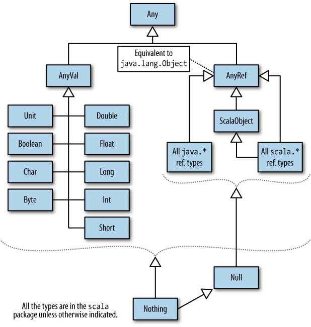

# The Scala Type System
## type keyword
1. 给类或者变量取一个别名，如 ``type String = java.lang.String``,``type Pair[+A, +B] = Tuple2[A, B]``

## 创建 Two-Item Tuple 的四种方式 
    1. ("hello",3.14)
    2. Pair("hello",3.14)
    3. Tuple2(“Hello”, 3.14)
    4. “Hello” → 3.14

## Class and objects
object 修饰的对象没有构造参数列表，也不能显示指定
Objects 会在运行时通过懒加载的方式自动创建出来 Objects are instantiated automatically and lazily by the runtime system

## Sealed Class Hierarchies 
如果想限制所有的子类在同一个源文件里定义 父类可以使用 ``sealed`` 关键字，多用于 case class，
在子类变化比较频繁的时候不要使用 ``sealed``

## The Scala Type Hierarchy

AnyVal 中所有的实例都是不可变的，且不能使用 ``new`` 实例化

AnyRef 所有包括 java.* 和 scala.* 及自定义类型的父类，等同于 java.lang.Object,需要使用 ``new`` 实例化\

Any 类结构的顶级类，==，!=,isInstanceOf[T] ,asInstanceOf[T] 等方法都在此类中定义

    

